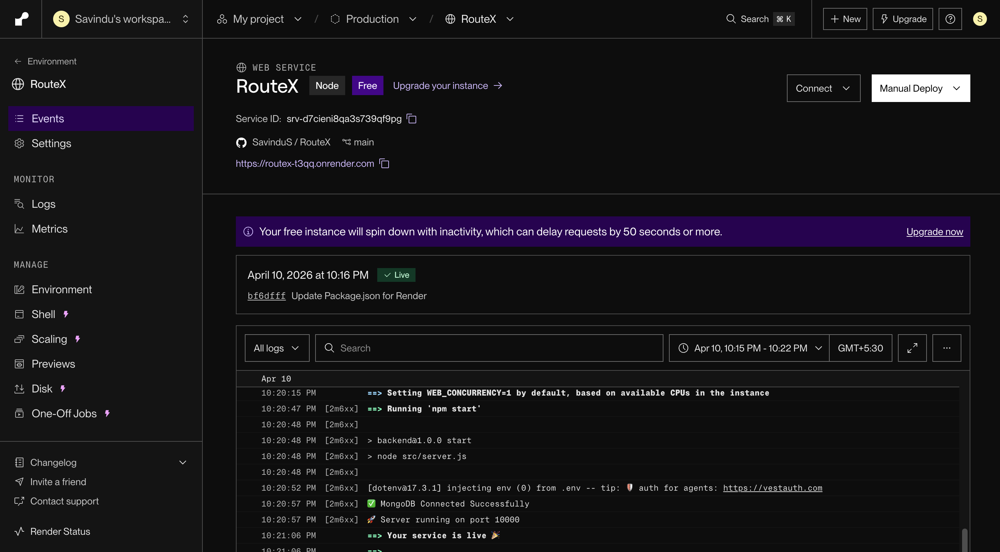
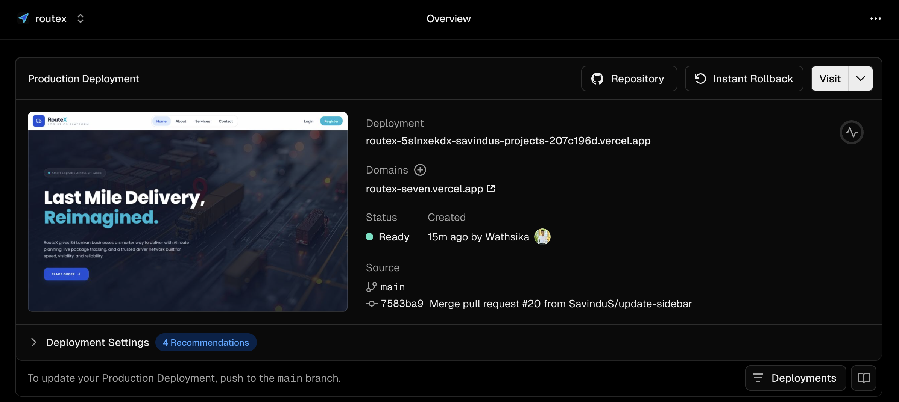

# RouteX - Smart Last-Mile Delivery Solution
### **SE3040 – Application Frameworks | Year 03 Assignment**

[](https://github.com/SavinduS/RouteX)
[](https://www.mongodb.com/mern-stack)
[](https://jwt.io/)

---

## 👥 Group Information (Group SE-39)
| Name | SLIIT ID | Contribution |
| :--- | :--- | :--- |
| **WEERARATHNA S.S.** | IT23588400 | **Project Setup, Deployment & Admin Dashboard (Analytics)** |
| **WASURA P.H.G.W.** | IT23591370 | **Driver Module & Real-time Location Tracking** |
| **DILSHAN M.P.G.W** | IT23586598 | **Entrepreneur Module & Order Management System** |
| **KALUPAHANA D. D.** | IT23785274 | **User & Session Management, UI/UX Development** |

**Batch:** 2026 Specialization in Software Engineering | **Campus:** SLIIT Main Campus

---

## 🚀 Live Deployment Links
| Component | Platform | Live URL |
| :--- | :--- | :--- |
| **🌐 Frontend App** | Vercel | [https://routex-app.vercel.app](https://routex-seven.vercel.app/) |
| **⚙️ Backend API** | Render | [https://routex-api.onrender.com](https://routex-t3qq.onrender.com) |

---

## 📖 Project Overview
**RouteX** is an intelligent logistics ecosystem designed to optimize the "last-mile" delivery process. By integrating real-time mapping, smart routing, and dynamic financial analytics, RouteX bridges the gap between entrepreneurs and delivery partners with professional-grade efficiency.

### **Core Modules**
*   **Admin Dashboard:** Financial oversight with real-time currency conversion and system-wide rule management.
*   **Entrepreneur Portal:** Automated delivery dispatching, Google-authenticated sessions, and order tracking.
*   **Driver Dashboard:** Live navigation interface with real-time route optimization and earnings tracking.

---

## 🛠 Tech Stack & Third-Party Integrations
RouteX leverages a modern MERN stack combined with industry-standard APIs to deliver a high-performance experience.

### **1. Core Stack**
*   **Frontend:** React.js (Functional Components, Hooks), Tailwind CSS, Framer Motion.
*   **Backend:** Node.js, Express.js, Socket.io (Real-time updates).
*   **Database:** MongoDB (Mongoose ODM).

### **2. Third-Party API Integrations (High-Value Features)**
| API | Purpose | Implementation Layer |
| :--- | :--- | :--- |
| **Google Auth** | Secure OAuth2.0 login and session management. | Frontend & Backend |
| **ExchangeRate API** | Real-time LKR to USD conversion for Admin revenue analytics. | Backend |
| **OSRM API** | **Open Source Routing Machine** for road-aware distance & fare calculation. | Backend |
| **Nominatim API** | Forward & Reverse geocoding for precise address selection (Entrepreneur side). | Frontend |
| **OpenRouteService** | Real-time route optimization and step-by-step directions (Driver side). | Frontend |
| **OpenStreetMap** | Interactive map tiles and spatial data provider. | Frontend |
| **MapTiler API** | Vector map styling for high-performance driver navigation. | Frontend |

---

## 📄 API Endpoint Documentation
All endpoints follow RESTful standards. Protected routes require a `Bearer <JWT_TOKEN>` in the `Authorization` header.

### **1. Authentication Module**
#### **POST** `/api/auth/register`
*   **Description:** Register a new user (Entrepreneur or Driver).
*   **Request Body:**
    ```json
    {
      "full_name": "Nimal Perera",
      "email": "Nimal@gmail.com",
      "password": "password123",
      "phone_number": "0771234567",
      "role": "entrepreneur"
    }
    ```
*   **Response (201 Success):**
    ```json
    {
      "message": "User registered successfully",
      "token": "eyJhbG...",
      "user": { "id": "64...", "full_name": "Nimal Perera", "role": "entrepreneur" }
    }
    ```

#### **POST** `/api/auth/login`
*   **Description:** Authenticate user and receive access token.
*   **Request Body:** `{ "email": "nimal@gmail.com", "password": "password123" }`
*   **Response (200 Success):** `{ "token": "eyJhbG...", "user": { ... } }`

#### **POST** `/api/auth/google`
*   **Description:** Secure OAuth2.0 login/registration via Google.
*   **Request Body:** `{ "credential": "<GOOGLE_ID_TOKEN>" }`

---

### **2. Logistics & Delivery Module**
#### **POST** `/api/delivery/create`
*   **Auth:** Required (Entrepreneur)
*   **Description:** Create a delivery order with automated fare calculation.
*   **Request Body:**
    ```json
    {
      "pickup_address": "SLIIT, Malabe",
      "dropoff_address": "Liberty Plaza, Colombo",
      "pickup_lat": 6.9147, "pickup_lng": 79.9729,
      "dropoff_lat": 6.9175, "dropoff_lng": 79.8519,
      "package_size": "medium", "receiver_name": "Jane Doe", "receiver_phone": "0711111111"
    }
    ```
*   **Response (201 Success):** Includes `total_cost`, `distance_km`, and `status: "available"`.

#### **GET** `/api/delivery/available`
*   **Auth:** Required (Driver)
*   **Description:** Fetches all nearby orders currently awaiting a driver.

---

### **3. Admin & Analytics Module**
#### **GET** `/api/admin/analytics/revenue`
*   **Auth:** Required (Admin Only)
*   **Description:** Fetches financial performance metrics with real-time **LKR to USD** conversion via ExchangeRate API.
*   **Response (200 Success):**
    ```json
    {
      "success": true,
      "data": {
        "stats": {
          "totalRevenue": 25000,
          "totalRevenueUSD": "82.50",
          "usdRate": 0.0033
        },
        "chartData": [ { "name": "Apr 10", "revenue": 5000 } ]
      }
    }
    ```

#### **PUT** `/api/admin/rules/:id`
*   **Auth:** Required (Admin Only)
*   **Description:** Update dynamic pricing multipliers and base fares.

---

## 🧪 Testing Instruction Report

### **1. Unit Testing**
*   **Focus:** Core business logic validation, including distance-based fare calculation and size multipliers.
*   **Command:** `cd backend && npm run test:unit`
*   **Location:** `backend/tests/unit/`

### **2. Integration Testing**
*   **Focus:** End-to-end API lifecycle testing, validating interactions between Express controllers, Middleware (Auth/RBAC), and MongoDB.
*   **Command:** `cd backend && npm run test:integration`
*   **Environment:** Uses `jest` with a dedicated MongoDB test database.

### **3. Performance Testing**
*   **Focus:** Validating system latency and throughput under high load using **Artillery.io**.
*   **Command:** `cd backend && npm run test:perf`
*   **Scenario:** Simulates 75 concurrent admin dashboard requests.

### **4. Testing Environment Configuration**
*   **NODE_ENV:** Set to `test` during execution to prevent production data mutation.
*   **Mocking:** `socket.io` and `nodemailer` are mocked in unit tests to ensure isolation.
*   **Timeout:** Integration tests are configured with a 30s timeout to accommodate database latency.

---

## 🌐 Deployment Report

### **Backend (Render)**
*   **Service Type:** Web Service
*   **Build Command:** `npm install`
*   **Start Command:** `node server.js`
*   **Env Vars:** `MONGO_URI`, `JWT_SECRET`, `GOOGLE_CLIENT_ID`, `ORS_API_KEY`, `EXCHANGE_RATE_KEY`.

### **Frontend (Vercel)**
*   **Framework:** Vite / React
*   **Root Directory:** `frontend`
*   **Env Vars:** `VITE_API_URL`, `VITE_MAPTILER_KEY`, `VITE_GOOGLE_CLIENT_ID`.

---

## 🚦 Local Setup Instructions
1.  **Clone:** `git clone https://github.com/SavinduS/RouteX.git`
2.  **Backend:** 
    *   `cd backend && npm install`
    *   Create `.env` with your API keys.
3.  **Frontend:** 
    *   `cd frontend && npm install`
    *   Create `.env` with `VITE_API_URL=http://localhost:5000`
4.  **Run:** `npm run dev`

---
## 📸 Deployment Evidence 

### **Backend Deployment (Render)**
*Evidence of successful Node.js environment setup and server startup.*


### **Frontend Deployment (Vercel)**
*Evidence of Vite build optimization and production distribution.*


---
*Developed for SLIIT Application Frameworks Module © 2026*